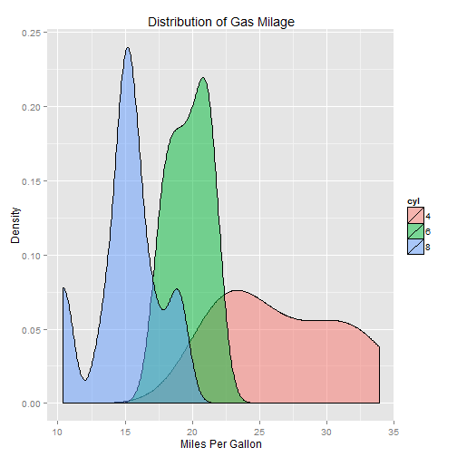
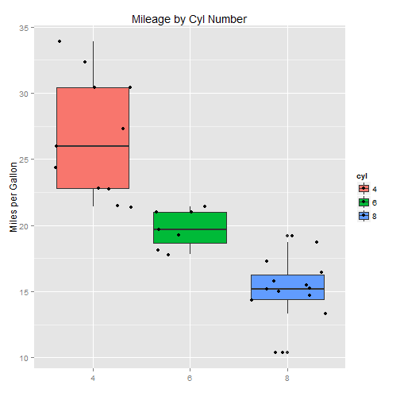

Developing Data Products - Course Project
========================================================
author: devdataprod-030
date: 7/17/15
transition: rotate

mpg Linear Regression Model - Objective
========================================================

Demonstrate a Linear Regression model over data collected by the 
Motor Trend magazine with a focus on cylinders. This is a expansion
of the Coursera Linear Regression Project.

- Interactive Exploratory Analysis for the mean
- Model Prediction comparing with Data Table
- shiny was used to build API and R-Presentation for the
support data product.


Revised mpg Model
========================================================

<small>In the Linear Regression Project we demostrated the lack of relevancy 
of transimission. In this project we are exploring number of cylinders as
factor.</small>


Revised Model : mtcars.lm <- lm(mpg ~ wt+hp+cyl, data = mtcars)


```
               Estimate Std. Error   t value     Pr(>|t|)
(Intercept) 35.84599532  2.0410191 17.562793 2.670320e-16
wt          -3.18140405  0.7196010 -4.421067 1.441756e-04
hp          -0.02311981  0.0119522 -1.934357 6.361269e-02
cyl6        -3.35902490  1.4016697 -2.396445 2.374718e-02
cyl8        -3.18588444  2.1704753 -1.467828 1.537047e-01
```


Potential Interaction by Cylinder [1]
========================================================


 

***
- 3 distribution of mpg by cylinder
- Shiny interaction should help illustrate

Potential Interaction by Cylinder [2]
========================================================
 

<small>Further illustrates cylinder effect</small>

***
- Shiny Model will quantify effect on mpg
- The proposed App visually portray the changes in cylinder
- Will also model and allow user to compare with 
a provided reference table.
